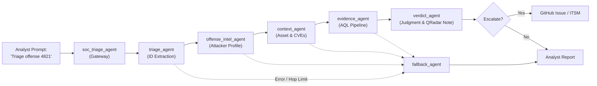
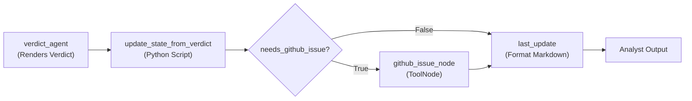

In a typical Security Operations Center (SOC), Tier-1 triage is an exhausting numbers game. Every time a new offense fires in a SIEM like IBM QRadar, an analyst spends 20 to 30 minutes doing standard legwork:

1. Grabbing the offense and identifying the top source IPs.
2. Pivoting out to WHOIS and IP geolocation lookups.
3. Reviewing the firing rule to gauge false-positive history.
4. Checking target assets for business criticality and matching unpatched CVEs.
5. Writing and executing AQL queries to inspect raw log events.
6. Synthesizing the evidence, writing an audit note, and escalating or closing the ticket.

When an analyst faces 40 to 50 offenses per shift, context-switching fatigue sets in, the backlog swells, and subtle anomalies get lost in the noise.

We wanted to automate this end-to-end without building a brittle, monolithic script or a slow, unconstrained autonomous agent that loops endlessly. 

Using **IBM watsonx Orchestrate (ADK & Flow Builder)** alongside the **Model Context Protocol (MCP)**, we built a fully autonomous **6-agent SOC investigation swarm** in days. Here is a look at the architecture, why the multi-agent approach was critical, and how we combined LLM reasoning with deterministic routing for speed, predictability, and performance.

---

## The Architecture: A 6-Agent Swarm

Rather than giving a single LLM a massive prompt and 15 different tools (which degrades reasoning accuracy and balloons token latency), we decomposed offense investigation into specialized, single-responsibility agents:



### Agent Roles & Responsibilities

1. **`soc_triage_agent` (Conversational Interface)**: Fronts the user interaction. Receives natural language prompts from the analyst, triggers the compiled flow, and relays the finalized markdown report verbatim.
2. **`triage_agent` (Target Extraction)**: Parses inputs like *"Investigate offense #4821 — real or noise?"* or bare IDs, extracting a clean numeric `offense_id` once at the entry point.
3. **`offense_intel_agent` (Attacker Profiling)**: Calls QRadar APIs to pull offense metadata, resolves local destination IPs, identifies the top source IP by magnitude, and runs external WHOIS and GeoIP enrichment.
4. **`context_agent` (Asset & Vulnerability Correlation)**: Evaluates firing rule fidelity (noisy threshold vs. high-fidelity correlation rule), inspects destination asset criticality (crown jewel vs. test host), and checks for unpatched CVEs matching the attack technique.
5. **`evidence_agent` (Raw Event Mining)**: Executes pre-validated AQL queries via the Ariel search pipeline to pull dominant event patterns and isolate outlier tails hidden inside event floods.
6. **`verdict_agent` (Synthesis & Audit)**: Weighs findings from all specialists, renders a verdict (`ESCALATE`, `BENIGN`, or `NEEDS_MORE_DATA`), and calls `add_offense_note` to write the audit trail directly into QRadar.
7. **`fallback_agent` (Graceful Degradation)**: Captures partial results if any tool fails or iteration limits are hit, presenting an honest partial investigation rather than failing silently.

---

## How watsonx Orchestrate Accelerated Development

Building multi-agent systems from scratch usually requires substantial glue code: message passing, state management, token management, tool connectivity, and error handling. watsonx Orchestrate collapsed that overhead:

### 1. Declarative Agent YAML Specs

Every agent is defined in plain YAML. Its instructions, constraints, LLM choice, and exposed tools live in a clean declarative format:

```yaml
spec_version: v1
kind: native
name: context_agent
description: Evaluates firing rules, asset criticality, and unpatched CVEs.
instructions: >
  Read offense_id and "## Offense Intel" from findings.
  1. Call get_rule on firing rule IDs to assess false-positive likelihood.
  2. Call list_assets and list_asset_properties on destination IP.
  3. Call list_vulnerabilities and list_qvm_assets to correlate CVEs.
  Append "## Context Analysis" markdown section to findings.
llm: groq/openai/gpt-oss-120b
style: react_core
tools:
  - qradar-mcp:get_rule
  - qradar-mcp:list_assets
  - qradar-mcp:list_asset_properties
  - qradar-mcp:list_vulnerabilities
  - qradar-mcp:list_qvm_assets
```

Adding or refining a specialist agent requires zero orchestrator rewrites—you modify the YAML and re-import via the ADK CLI:

```bash
orchestrate agents import --file wxo-config/agents/context_agent.yaml
```

### 2. Instant Tool Integration via MCP

QRadar REST APIs were wrapped as a standard **Model Context Protocol (MCP)** server. Instead of writing custom API integration clients, formatting schemas, and managing custom serializers, watsonx Orchestrate natively discovers and binds MCP tools directly into agent toolsets.

---

## Balancing Multi-Agent Flexibility with High Performance

A frequent pitfall of autonomous multi-agent swarms is **latency and non-determinism**. If an LLM decides routing at every hop, it consumes reasoning tokens just to choose the next agent, creating loops, high API costs, and sluggish execution.

We solved this using watsonx Orchestrate Flow Builder with three design principles:

### 1. Hybrid Architecture: LLM Reasoning + Deterministic Python State Machine

While each specialist agent uses LLM reasoning to interact with its domain tools, the **swarm routing between agents is completely deterministic**:

```python
from ibm_watsonx_orchestrate.flow_builder.flows import Flow, flow, START, END, ScriptNode, AgentNode

@flow(
    name="offense_triage_workflow",
    input_schema=FlowInput,
    output_schema=str,
    private_schema=SwarmState,
)
def build_offense_triage_flow(flow: Flow) -> Flow:
    # 1. State initialization
    setup_state = flow.script(name="setup_swarm_state", script="...")
    
    # 2. Extract offense ID once via LLM
    triage = flow.agent(name="triage_agent", agent="triage_agent", ...)
    
    # 3. Deterministic state updater & transition router
    update_triage = flow.script(name="update_state_from_triage", script="...")
    
    # Wire the pipeline
    flow.edge(START, setup_state)
    flow.edge(setup_state, triage)
    flow.edge(triage, update_triage)
    ...
```

After an agent finishes its work, a lightweight Python `ScriptNode` updates `SwarmState` (appending completed step tokens like `offense_intel: steps 1-3 complete` and accumulated markdown findings). The central flow branch checks these tokens deterministically:

```python
_ROUTING_LOGIC = """
steps_str = " | ".join(flow.private.steps_taken)
intel_done    = "offense_intel: steps 1-3 complete" in steps_str
context_done  = "context: steps 4-6 complete"       in steps_str
evidence_done = "evidence: step 7 complete"          in steps_str

if not intel_done:
    flow.private.next_agent = "offense_intel_agent"
elif not context_done:
    flow.private.next_agent = "context_agent"
elif not evidence_done:
    flow.private.next_agent = "evidence_agent"
else:
    flow.private.next_agent = "verdict_agent"
"""
```

**Why this matters:**
- **Zero wasted tokens:** Routing takes 0 ms and costs 0 LLM tokens.
- **Predictable execution order:** The investigation follows a standard operating procedure (Intel → Context → Evidence → Verdict) without skipping steps.
- **Resilience:** If any specialist agent encounters unrecoverable errors, the routing logic detects repeated failures and transfers immediately to the `fallback_agent`.

### 2. Guardrails Against Token Bloat: The AQL Outlier Query Pipeline

In high-volume SIEM environments, offenses can trigger thousands of events. A naive agent trying to inspect thousands of raw events will exceed LLM context windows and stall.

In our `evidence_agent`, we built a two-pronged Ariel Search pipeline:

1. **Dominant Pattern Query:** Groups by `sourceip, destinationip, category, qid` ordered by `COUNT(*) DESC` to summarize the high-volume flood.
2. **Outlier Tail Query:** Same grouping ordered by `COUNT(*) ASC` (limit 5) to surface low-volume anomalies that attackers attempt to conceal inside noisy traffic.

```sql
SELECT sourceip, destinationip, category, qid, COUNT(*) AS event_count
FROM events
WHERE INOFFENSE({offense_id})
GROUP BY sourceip, destinationip, category, qid
ORDER BY event_count DESC
LAST 7 DAYS
```

The agent validates the syntax with `validate_aql`, runs `create_ariel_search`, and fetches concise structured tables. The LLM processes exactly the signal it needs without wading through megabytes of raw text.

### 3. Closing the Loop: Deterministic ITSM & QRadar Actions

Many agent implementations stop at generating chat recommendations. Our swarm closes the operational loop:

- **Auditability inside QRadar:** The `verdict_agent` invokes `add_offense_note` to post the complete investigation findings and reasoning chain directly into the offense.
- **Automated ITSM Escalation:** A dedicated `ToolNode` conditionally creates a GitHub Issue / ticketing incident when the verdict is `ESCALATE` or `NEEDS_MORE_DATA`:



Because the escalation trigger is governed by deterministic script logic rather than an autonomous tool call, we prevent accidental duplicate ticketing and hallucinated ticket creations.

---

## The End Result

When an analyst triggers triage:

```text
Analyst: "Investigate offense #4821 — is this a real threat or noise?"
```

In under 45 seconds, the swarm returns:

```markdown
## 🔍 Offense Triage Result

**Verdict:** ESCALATE 🔴

**Summary:** Offense #4821 triaged: ESCALATE. Source 198.51.100.23 (RU, ASN 4134, Hosting Provider) 
triggered "Exploit: Apache Struts OGNL Injection" (Low FP-Likelihood) against payments-api-prod 
(Critical Asset). Matched CVE-2017-5638 (CVSS 10.0, Unpatched). 342 raw events observed (initial 
remote code execution payload followed by lateral connection attempt). Escalate to Tier-2 analyst 
for immediate containment. Note written to QRadar offense 4821.

**QRadar Note:** Written ✓

**Steps completed:**
- offense_intel: steps 1-3 complete
- context: steps 4-6 complete
- evidence: step 7 complete
- verdict_agent
```

### Key Takeaways

1. **Deconstruct complex workflows into specialized agents:** Smaller prompts with targeted toolsets produce drastically higher reasoning fidelity than monolithic agents.
2. **Combine LLM reasoning with deterministic routing:** Use LLMs for domain-specific comprehension and tool interpretation, but let deterministic workflows manage control flow and ticketing triggers.
3. **Keep the audit trail in the system of record:** Writing timestamped reasoning chains back into QRadar ensures transparency, compliance, and seamless handoffs between autonomous agents and human analysts.
4. **watsonx Orchestrate as a unified foundation:** By providing declarative agent definitions, Flow Builder graphs, and native MCP support, watsonx Orchestrate allowed us to build, test, and ship a production-grade multi-agent architecture in a fraction of traditional development time.
