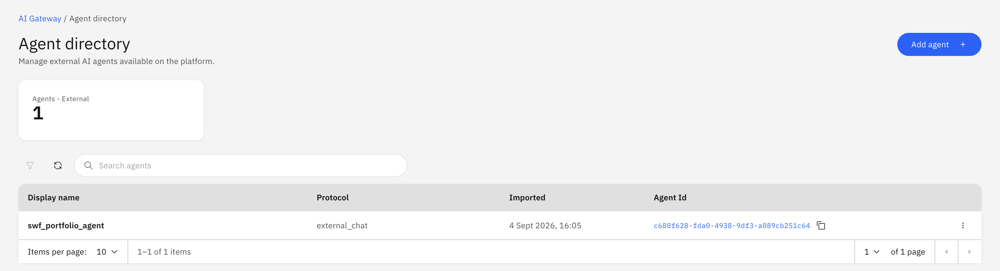
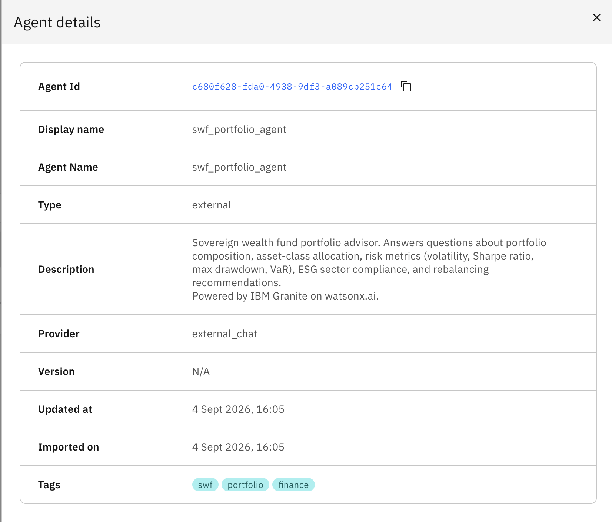
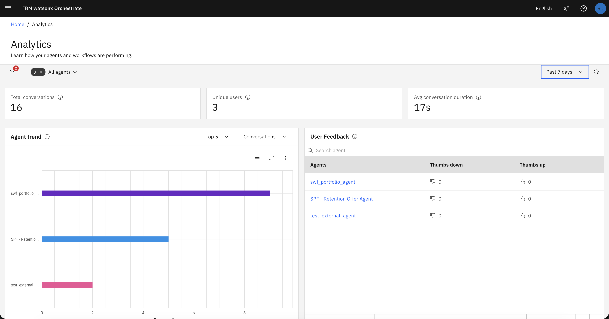
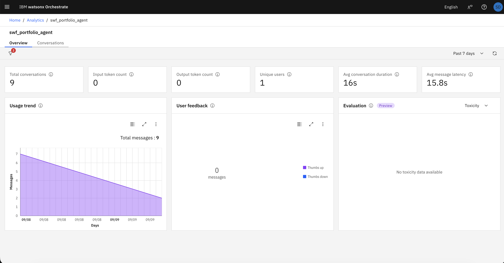
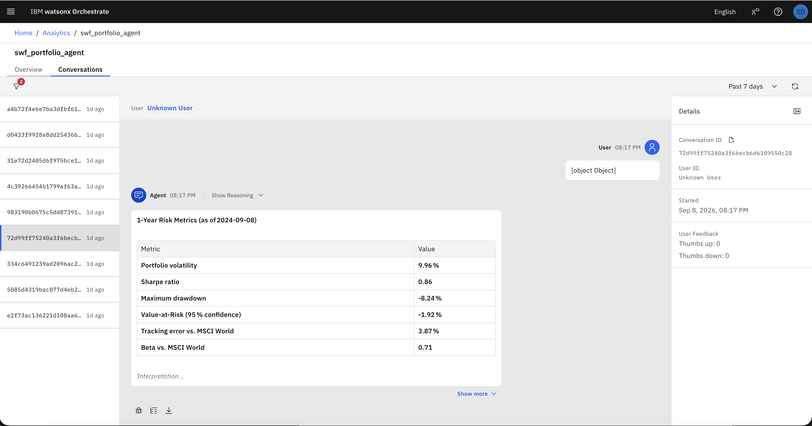
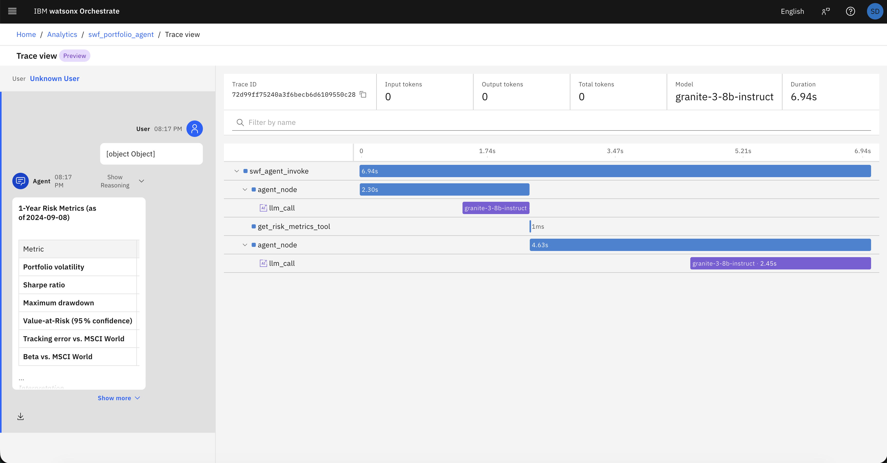
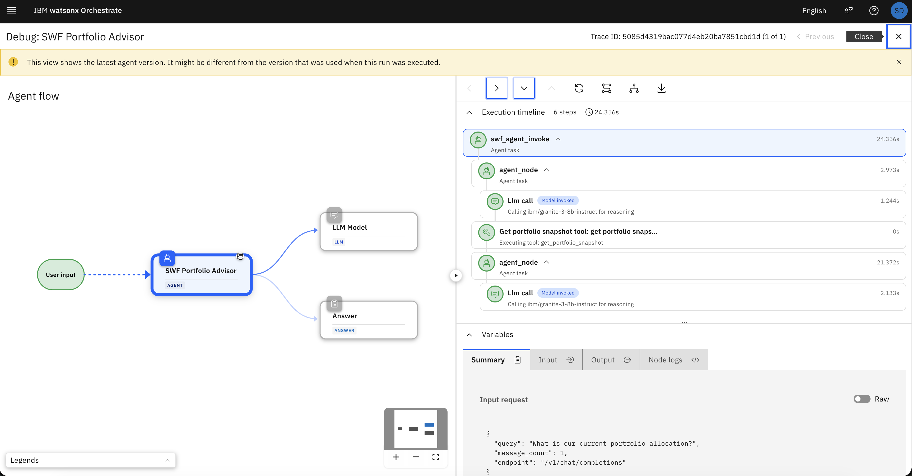

A year ago, the conversation around agentic AI was mostly about *building* agents — picking a framework, wiring up tools, getting a ReAct loop to reliably call the right function. That problem is largely solved. The harder question that enterprises are now facing is a different one: **how do you run agents at scale, across teams, across frameworks, and across cloud environments — and actually know what they're doing?**

This is the question that IBM watsonx Orchestrate is increasingly designed to answer. What started as a no-code agent builder and business automation platform has been quietly evolving into something with a broader mandate: an **agent control plane**.

The distinction matters. An agent *builder* helps you create agents. An agent *control plane* is the operational layer that governs all agents in your organization — regardless of where they were built, what framework they run on, or where they are hosted. Think of it the way you'd think of a Kubernetes control plane for containers, or an API gateway for microservices: it's the surface through which you register, route to, monitor, and govern a distributed fleet of autonomous systems.

In practice, that means watsonx Orchestrate is growing capabilities across several dimensions simultaneously:

- **Orchestration** — routing user intent to the right agent or chain of agents, with support for both native and externally-hosted agents.
- **Identity and access** — knowing which agents exist, who owns them, and what they're allowed to do.
- **Lifecycle management** — deploying, versioning, and retiring agents through a consistent interface.
- **Observability** — capturing traces, spans, LLM calls, and tool invocations across the entire agent graph, even when parts of it run outside the platform.

That last capability — **observability** — is what this post is about.

Observability is not a nice-to-have for agentic systems. When an agent makes a wrong decision, triggers an unexpected tool, or produces a hallucinated output, the first question your team will ask is *what actually happened inside that run?* Without structured traces, you are debugging blind. And in multi-agent architectures — where a WxO orchestrator delegates to a downstream specialist agent, which itself calls three tools — "debugging blind" means you have no idea which node in the chain caused the problem.

watsonx Orchestrate's **Agent Analytics** solves this by giving you a unified trace view across the entire execution graph. Native WxO agents get this automatically. Externally running agents — the ones you built yourself, on whatever framework, running wherever you want — can participate in exactly the same trace hierarchy through the **WxO Observability SDK** and a W3C-standard `traceparent` header.

This post walks through exactly how to wire that up, end-to-end.

---

## What We're Building

The example in this guide is a simple, fully working **LangGraph agent** that:

- Is built with **LangGraph** (the most widely used open-source agent framework today).
- Uses **IBM Granite on watsonx.ai** as its LLM via `langchain-ibm`.
- Runs as a **self-hosted process** — on your laptop, a VM, or anywhere else — and exposes an OpenAI-compatible HTTP endpoint.
- Is **registered in watsonx Orchestrate** as an external agent so WxO can route requests to it.
- Pushes **structured traces** back to WxO Agent Analytics via the Observability SDK, including participating in distributed parent-child traces when WxO itself is the orchestrator.

Here's the high-level picture of how the pieces connect at runtime:

```
┌─────────────────────────────────────────────────────────────────┐
│                      watsonx Orchestrate                         │
│                                                                  │
│   User ──► WxO Orchestrator                                      │
│                    │                                             │
│          ① route request + traceparent header                    │
│                    │                                             │
│                    ▼                             ┌─────────────┐ │
│                                                 │  Your Agent │ │
│   Agent Analytics ◄─────── ② SDK traces ────────│  (anywhere) │ │
│   (unified trace view)                          │             │ │
│                                                 │  LangGraph  │ │
│                                                 │  + Tools    │ │
└─────────────────────────────────────────────────└─────────────┘─┘
```

The key insight is the flow of data: requests travel *down* from WxO to your agent, while traces travel *up* independently via the SDK. The `traceparent` header is what stitches them into a single coherent tree in Agent Analytics.

---

## Part 1 — Instrumenting the Agent

### Step 1: Install the Observability SDK

The WxO Observability SDK is currently distributed through **Test PyPI**. Your `requirements.txt` needs to pull from both the Test PyPI index (for the SDK) and the regular PyPI index (for everything else):

```txt
--index-url https://test.pypi.org/simple/
--extra-index-url https://pypi.org/simple/

# WxO Observability SDK
ibm-watsonx-orchestrate-sdk>=2.16.0

# LangGraph — minimum 0.6.0 for WxO import compatibility
langgraph>=0.6.0
langchain-core>=0.3.0

# LLM provider: IBM Granite on watsonx.ai
ibm-watsonx-ai>=1.7.1
langchain-ibm>=0.3

# HTTP server
fastapi>=0.111.0
uvicorn[standard]>=0.29.0
python-dotenv>=1.0
```

```bash
python3 -m venv .venv
source .venv/bin/activate
pip install -r requirements.txt
```

The dual-index setup is the most common gotcha at this step. If you omit `--extra-index-url https://pypi.org/simple/`, pip will try to resolve `fastapi`, `langgraph`, and all the other standard packages from Test PyPI and fail.

---

### Step 2: Bootstrap the Tracer at Process Startup

The tracer is the bridge between your agent process and WxO Agent Analytics. It must be created **once, at startup, before any instrumented functions are called**. Creating it lazily — or after your decorators have already been evaluated — will result in spans being dropped.

The SDK supports four deployment scenarios, all controlled by a single `PLATFORM` environment variable:

| `PLATFORM` | When to use | Key env vars |
|---|---|---|
| `otlp` | Local dev / Jaeger — no WxO instance needed | `WXO_OTLP_ENDPOINT` (optional) |
| `local` | WxO dev-edition running on your machine | `WXO_LOCAL_URL` |
| `ibm` | WxO SaaS on IBM Cloud | `WXO_API_KEY`, `WXO_INSTANCE_URL`, `WXO_TENANT_ID` |
| `aws` | WxO SaaS on AWS | `WXO_API_KEY`, `WXO_INSTANCE_URL` |

The IBM Cloud path looks like this:

```python
# tracer_setup.py (IBM Cloud path)
import atexit, os
from ibm_watsonx_orchestrate_sdk import Client
from ibm_watsonx_orchestrate_sdk.observability import Tracer, TracerConfig, register_tracer

def configure_tracer() -> Tracer:
    client = Client(
        api_key=os.environ["WXO_API_KEY"],
        instance_url=os.environ["WXO_INSTANCE_URL"],
        iam_url="https://iam.cloud.ibm.com",
        auth_type="ibm_iam",
    )
    config = TracerConfig(
        service_name=os.environ.get("WXO_SERVICE_NAME", "my-langgraph-agent"),
        client=client,
        agent_id=os.environ.get("WXO_AGENT_ID"),
        tenant_id=os.environ.get("WXO_TENANT_ID"),
        workspace_id=os.environ.get("WXO_WORKSPACE_ID"),
        environment=os.environ.get("WXO_ENVIRONMENT", "draft"),
    )

    config.validate()        # ← raises immediately on bad credentials or missing fields
    tracer = Tracer(config)
    register_tracer(tracer)  # ← makes the tracer globally available to all decorators

    # Flush in-flight spans gracefully when the process exits
    atexit.register(lambda: (tracer.force_flush(5000), tracer.shutdown()))
    return tracer
```

Three things worth calling out here:

**`config.validate()`** catches misconfiguration at startup — wrong API key format, missing tenant ID, unreachable instance URL — rather than silently dropping spans at runtime. Always call it.

**`register_tracer(tracer)`** puts the tracer instance into a global registry that all the SDK decorators read from. You don't have to pass a tracer object around; the decorators find it automatically once it's registered.

**The `atexit` hook** matters more than it looks. Agent processes are often killed with `Ctrl+C` or a SIGTERM in containerized environments. Without this hook, spans that are buffered but not yet exported will be lost when the process exits.

---

### Step 3: Decorate the Agent Graph

The SDK provides four decorators that map naturally onto the layers of a LangGraph agent. Think of them as a stack: each decorator covers one layer, and together they produce a complete, nested span tree.

| Layer | Decorator | What it traces |
|---|---|---|
| Graph factory | `@configure_tracing` | Propagates the WxO execution context into the graph |
| LangGraph node | `@trace_agent_call` | One span per node invocation, with state input/output |
| LLM call | `@trace_llm_call` | One span per LLM invocation, with model and provider metadata |
| Tool | `@trace_tool_call` | One span per tool execution, with arguments and return value |

#### `@configure_tracing` — the graph factory

This decorator goes on the function that builds your `StateGraph`. Its job is to extract the WxO `execution_context` from LangGraph's `RunnableConfig` and make it available to all child spans created during the run.

```python
# agent.py
from ibm_watsonx_orchestrate_sdk.observability.decorators import (
    configure_tracing, trace_agent_call, trace_llm_call,
)
from langgraph.graph import END, START, StateGraph

@configure_tracing
def create_agent(config: RunnableConfig) -> StateGraph:
    workflow = StateGraph(AgentState)
    workflow.add_node("agent", agent_node)
    workflow.add_node("tools", ToolNode(TOOLS))
    workflow.add_edge(START, "agent")
    workflow.add_conditional_edges("agent", should_continue, {"tools": "tools", END: END})
    workflow.add_edge("tools", "agent")
    return workflow  # ⚠️ Return UNCOMPILED — WxO runtime calls .compile() itself
```

> One subtlety: when WxO imports this agent as a **LangGraph package** (the packaged import path), it calls `create_agent()` and then calls `.compile()` itself — so you must return the uncompiled `StateGraph`. When running as an **external server**, you call `.compile()` yourself in `server.py`. The same function serves both modes.

#### `@trace_agent_call` — the LangGraph node

This creates the span you'll see most prominently in the trace view — one per decision cycle through the agent node.

```python
@trace_agent_call(
    name="agent_node",
    agent_name="my-langgraph-agent",
    framework="langgraph",
    capture_input=True,
    capture_output=True,
    attributes={"agent_type": "my_agent", "has_tools": "true"},
)
def agent_node(state: AgentState, config: RunnableConfig) -> AgentState:
    llm = ChatWatsonx(model_id="ibm/granite-3-8b-instruct", ...).bind_tools(TOOLS)
    messages = [SystemMessage(content=SYSTEM_PROMPT)] + state["messages"]
    response = _invoke_llm(llm, messages)
    return {"messages": [response]}
```

The `attributes` dict lets you attach arbitrary key-value metadata to the span — team, domain, agent variant — that's queryable in the Agent Analytics filter panel.

#### `@trace_llm_call` — the LLM invocation

Wrapping the LLM call in its own function gives `@trace_llm_call` a clean boundary to instrument. The `model` and `provider` fields appear as structured metadata in the trace.

```python
@trace_llm_call(
    name="llm_call",
    capture_input=True,
    capture_output=True,
    model="ibm/granite-3-8b-instruct",
    provider="watsonx",
    attributes={"agent_type": "my_agent"},
)
def _invoke_llm(llm: ChatWatsonx, messages: list[BaseMessage]) -> AIMessage:
    return llm.invoke(messages)
```

#### `@trace_tool_call` — the tools

This is where decorator ordering matters and is easy to get wrong. `@tool` (the LangChain decorator) must be the **outermost** decorator. `@trace_tool_call` wraps the raw Python function; then `@tool` wraps the already-traced function. Reversing them breaks LangChain's tool introspection.

```python
# tools.py
from langchain_core.tools import tool
from ibm_watsonx_orchestrate_sdk.observability.decorators import trace_tool_call

@tool                              # ← outermost: LangChain sees the traced function
@trace_tool_call(                  # ← inner: wraps the raw function
    name="my_tool",
    capture_input=True,
    capture_output=True,
    tool_name="my_tool",
    attributes={"domain": "example"},
)
def my_tool(input: str) -> str:
    """An example tool that does something useful."""
    ...
```

The `attributes` dict is your opportunity to attach domain-specific metadata — data source, operation type, business context — that will be queryable in Agent Analytics.

---

### Step 4: Serve an OpenAI-Compatible Endpoint with Trace Propagation

WxO routes requests to external agents via a standard **OpenAI-compatible `/v1/chat/completions`** endpoint, or via the **Agent-to-Agent (A2A) protocol** for agents that advertise an A2A agent card. There is nothing exotic about either protocol — if you've used the OpenAI Python client you already know the chat-completions request and response shape, and A2A is a straightforward JSON-RPC-style spec over HTTP.

What's less obvious is the **distributed tracing** part. When WxO calls your agent as part of a multi-agent workflow, it forwards a **W3C `traceparent` header**. This header carries the trace ID and span ID of WxO's own active span. If your server reads this header and attaches it as the parent OpenTelemetry context *before* running the agent, all spans your agent creates will appear as *children* of WxO's root trace in Agent Analytics.

```python
# server.py
from tracer_setup import configure_tracer, tracer as _module_tracer
from opentelemetry import context as otel_context
from opentelemetry.trace.propagation.tracecontext import TraceContextTextMapPropagator

# ① Bootstrap tracer BEFORE any decorated functions are imported
_tracer = configure_tracer()

app = FastAPI(title="My LangGraph Agent")
_propagator = TraceContextTextMapPropagator()

@app.post("/v1/chat/completions")
async def chat_completions(request: Request) -> ChatCompletionResponse:
    # ② Extract the traceparent WxO forwarded (if present)
    traceparent = request.headers.get("traceparent")
    token = None
    if traceparent:
        ctx = _propagator.extract({"traceparent": traceparent})
        token = otel_context.attach(ctx)  # ← makes this the active OTel context

    try:
        # ③ Wrap the entire agent run in a root span
        with _module_tracer.start_span("my_agent_invoke") as span:
            span.set_attribute("input", json.dumps({"query": lc_messages[-1].content}))
            graph = create_agent(config={}).compile()
            final_state = graph.invoke({"messages": lc_messages})
            answer = final_state["messages"][-1].content
            span.set_status_ok()

        return ChatCompletionResponse(...)

    finally:
        # ④ Always detach the context — even if the agent raises
        if token is not None:
            otel_context.detach(token)
```

The `finally` block is not optional. If an exception occurs between `attach()` and `detach()`, the OTel context leaks into the next request on the same thread. In an async server with a thread pool, this silently corrupts traces in ways that are extremely hard to debug.

The resulting span tree in Agent Analytics will look like this:

```
my_agent_invoke             ← start_span() in server.py
  └─ agent_node             ← @trace_agent_call
       └─ llm_call          ← @trace_llm_call  (model: granite-3-8b-instruct)
            └─ my_tool      ← @trace_tool_call
            └─ another_tool
```

If WxO forwarded a `traceparent`, the entire `my_agent_invoke` tree appears as a child of WxO's own span, stitched together in a single end-to-end trace view.

---

## Part 2 — Registering the Agent in watsonx Orchestrate

Once the agent is running and instrumented, you need to tell watsonx Orchestrate it exists. This is a two-step process: expose the server on a URL WxO can reach, then register it via a descriptor file or the UI.

### Step 5: Start the Server and Get a Public URL

```bash
source .venv/bin/activate
uvicorn server:app --host 0.0.0.0 --port 8000 --reload
```

Verify:

```bash
curl http://localhost:8000/health
# → {"status":"ok","agent":"my-langgraph-agent"}
```

If WxO is running in the cloud, it needs to reach your server over a public URL. [ngrok](https://ngrok.com) is the fastest way to get there during development:

```bash
ngrok http 8000
# Forwarding  https://<subdomain>.ngrok-free.app → http://localhost:8000
```

> On the free ngrok tier, the subdomain changes every time you restart ngrok. For anything beyond a quick demo, use a paid plan for a stable subdomain, or deploy the agent process to a cloud VM.

---

### Step 6: Author the Agent Descriptor

The `agent.yaml` file describes your external agent to WxO. It's a simple YAML file with a handful of required fields:

```yaml
spec_version: v1
kind: external           # tells WxO this agent runs outside the platform

name: my_langgraph_agent
title: My LangGraph Agent
nickname: my_langgraph_agent

provider: external_chat  # OpenAI-compatible chat completions protocol

description: |
  A simple LangGraph agent powered by IBM Granite on watsonx.ai.

tags:
  - langgraph
  - external

api_url: "https://<your-subdomain>.ngrok-free.app"

auth_scheme: NONE   # BEARER_TOKEN | API_KEY | NONE

chat_params:
  stream: false

config:
  hidden: false
  enable_cot: false
```

The fields that matter most:

- **`kind: external`** — tells WxO the agent is self-hosted. Without it, WxO would treat this as a native agent descriptor.
- **`provider: external_chat`** — selects the OpenAI-compatible protocol. WxO will POST to `api_url + /v1/chat/completions`.
- **`api_url`** — the base URL of your running server. Update this whenever your ngrok URL changes.
- **`auth_scheme`** — `NONE` is fine for a local ngrok tunnel. Use `BEARER_TOKEN` or `API_KEY` in production.

---

### Step 7: Import the Agent

#### Option A — CLI (recommended)

```bash
orchestrate agents import -f agent.yaml
```

> 📸 *Screenshot: terminal output of a successful `orchestrate agents import` command, showing the agent name and the agent ID returned by the CLI.*

That's it. WxO registers the descriptor and will call your server at `api_url` whenever the agent is invoked — directly by a user or as a delegated step in a multi-agent workflow.

#### Option B — UI

Go to **AI Gateway → Agent directory**, click **Add agent +**, and follow the **Import agent** wizard:

1. **Provide details** — set purpose to **Import for use and observability**, choose your protocol (**External agent via A2A protocol** or **External agent via chat completion**), and fill in the service URL and auth credentials.
2. **Define new agent** — enter a display name and description.
3. Click **Register**, then complete the **Connection** step and click **Register** again to finish.



---

### Step 8: Get Your Agent ID and Close the Loop

After import, WxO assigns your agent a unique **Agent ID**. This is the last piece of the observability puzzle: the SDK needs this ID to tag every trace it ships with the correct agent record in Agent Analytics. Without it, traces arrive but are unlinked from the registered agent.

Open the agent's detail page in the WxO UI. The Agent ID is displayed in the agent settings panel.



Copy it into your `.env`:

```bash
WXO_AGENT_ID=<paste-agent-id-here>
```

Then restart the server so the tracer picks it up. You'll see it logged on startup:

```
[TRACER] ✓ Tracer registered [service=my-langgraph-agent, platform=ibm]
```

---

## Part 3 — Verifying Traces in Agent Analytics

### Step 9: Configure Your Environment

Here's the complete `.env` for the IBM Cloud deployment:

```env
# Which WxO deployment to target for trace ingestion
PLATFORM=ibm

# watsonx.ai credentials (the LLM backend)
WATSONX_APIKEY=<your-ibm-cloud-api-key>
WATSONX_URL=https://us-south.ml.cloud.ibm.com
PROJECT_ID=<your-watsonx-project-id>

# WxO Observability — all required for PLATFORM=ibm
WXO_API_KEY=<your-wxo-api-key>
WXO_INSTANCE_URL=https://api.watson-orchestrate.ibm.com/instances/<instance-id>
WXO_TENANT_ID=<account-id>_<instance-id>   # IBM Cloud only; not needed on AWS
WXO_AGENT_ID=<from-step-8>
WXO_WORKSPACE_ID=00000000-0000-0000-0000-000000000001
WXO_ENVIRONMENT=draft
WXO_SERVICE_NAME=my-langgraph-agent
```

For local development against the WxO dev-edition, `PLATFORM=local` with `WXO_LOCAL_URL=http://localhost:4322` is sufficient — no API keys needed.

---

### Step 10: Fire a Test Request

```bash
curl -X POST http://localhost:8000/v1/chat/completions \
  -H "Content-Type: application/json" \
  -d '{
    "messages": [
      {"role": "user", "content": "Hello, what can you help me with?"}
    ]
  }'
```

Watch the server logs. A healthy run looks like this:

```
[TRACER] Platform=ibm — connecting to https://api.watson-orchestrate.ibm.com/...
[TRACER] ✓ Configuration valid
[TRACER] ✓ Tracer registered [service=my-langgraph-agent, platform=ibm]
[SERVER] Received query: Hello, what can you help me with?
[TRACE] No traceparent header — starting new trace
[SERVER] Agent answer: I can help you with...
[TRACER] Flushing traces before exit...
```

When called *from WxO* rather than directly, `[TRACE] No traceparent header` is replaced by `[TRACE] Attached parent trace context: 00-...` — that's what confirms distributed tracing is working.

---

### Step 11: Inspect the Trace in Agent Analytics

Open the WxO UI and navigate to **Agent Analytics**. You should see a new trace entry for your recent run.



The **Overview** tab shows high-level stats for the agent — usage trend, user feedback, total conversations, and average latency.



Switch to the **Conversations** tab to replay individual runs and inspect the messages exchanged.



Click **Trace view** on a conversation to see the full span timeline — `swf_agent_invoke` (root) → `agent_node` → `llm_call` → tool spans, with durations on each.



The **Debug view** overlays the execution timeline on the agent's flow graph and lets you drill into each node's input, output, and logs.



---

### Step 12: See the End-to-End Distributed Trace

The real payoff comes when WxO orchestrates your external agent as part of a multi-agent workflow. WxO forwards a `traceparent` header carrying its own active trace context; your server attaches it; every span your agent creates gets parented to WxO's root. The result is a single trace that spans both sides of the boundary.

To simulate this without setting up a full orchestrator workflow, pass a synthetic `traceparent` directly:

```bash
curl -X POST http://localhost:8000/v1/chat/completions \
  -H "Content-Type: application/json" \
  -H "traceparent: 00-4bf92f3577b34da6a3ce929d0e0e4736-00f067aa0ba902b7-01" \
  -d '{
    "messages": [
      {"role": "user", "content": "Hello, what can you help me with?"}
    ]
  }'
```

In Agent Analytics, look for the trace with ID `4bf92f3577b34da6a3ce929d0e0e4736`. The `my_agent_invoke` span appears as a child within it, with all the nested tool spans beneath.


This is the view that makes debugging multi-agent failures tractable. You can see exactly which agent was called, when, with what input, and what each tool returned — across an execution that spans multiple independently running processes.

---

## Conclusion

The SDK, the decorators, and the `traceparent` header propagation are all small additions to an agent you likely already have. The payoff — a full, correlated span tree across every LLM call, tool invocation, and agent delegation, visible in a single place — is what makes debugging multi-agent workflows tractable at scale. Once the wiring is in place, every agent in your fleet, regardless of where it runs or what framework it uses, becomes a first-class citizen of WxO's observability layer.

---

## Further Reading

- [WxO Observability SDK — official procedure](https://developer.watson-orchestrate.ibm.com/traces/observability-sdk#procedure)
- [WxO External Agent import guide](https://developer.watson-orchestrate.ibm.com/agents/external-agents)
